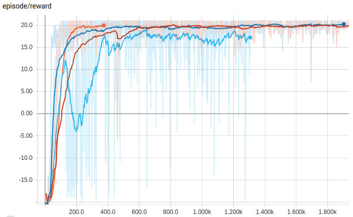

# PyToRL: PyTorch Toolbox for Reinforcement Learning
### [PROJECT CURRENTLY UNDER DEVELOPMENT]

&nbsp;  

**Simple Description:**
<pre>
This project, named pytorl, is intended to be an RL toolbox for pytorch and 
contains RL algorithm implementations using this pytorl toolbox. As I am 
currently learning RL, I am going to update this project with other agents, 
algorithms and faster or more efficient implementations soon. 
</pre>

&nbsp;  

**Current Progress:**
<pre>
Implemented 4 DQN(and its variants) algorithms and a distributed DQN learning
algorithm named Gorila via parameter server architecture. Will move on to A2C,
A3C, TRPO, PPO ...

Note that I use slurm for distributed RL training since my work is done on
clusters, but I still provide a "local run" option which helps the project runs
without slurm :).
</pre>

&nbsp;  

**Some Dependencies Currently Used for Developing:**
> gym == 0.10.11 with atari  
> numpy == 1.14.3  
> python == 3.6.5  
> pytorch == 1.0.1  
> tensorboard = 1.9.0  
> tensorboardX == 1.4  

&nbsp;  

**Simple Setup from Scratch:**
```bash
# 1. clone this repo to local
$ git clone <this repo address>.git
# 2. run simple setup script
# the <path> here is where you want to put your experiments latter on
# your experiments launched by this toolbox provided "rl-run" entry will be 
# automatically moved to the <path> and start executing at there rather than
# running directly at the dir currently you are working on, good for developing
$ python dev_setup.py -dir <path>
```

&nbsp;  

**Run Example Projects after Setup:**
```bash
# run_project folder contains scripts for job starting
$ cd examples/<project main folder>/run_project
$ sh <script filename> [-h] <options>
# for example, you can try sh ATARI.sh -N testrun --local
# you can always use sh <script filename> [-h] for options help
```

&nbsp;  

**Demo of Some RL Results:**  

  
*(reward/episode while training ale atari PongNoFrameskip-v4 via diff. DQN algorithms)*  

&nbsp;  

**Acknowledgements:**  
1. During the development, I referred to some helpful resources, listed as follows:  
    - @qfettes/DeepRL-Tutorials repo for nice tutorials and designs
    - @openai/baselines for some implementations
    - my mentor and colleague Huabin Zheng (https://dblp.org/pers/hd/z/Zheng:Huabin)  
      for technical consultation and extraordinary design ideas
    - other helpful sources and geniuses from websites such as stackoverflow, GeeksforGeeks, etc.

<pre>    Thanks them all for making our open source world a better place! :) </pre>
