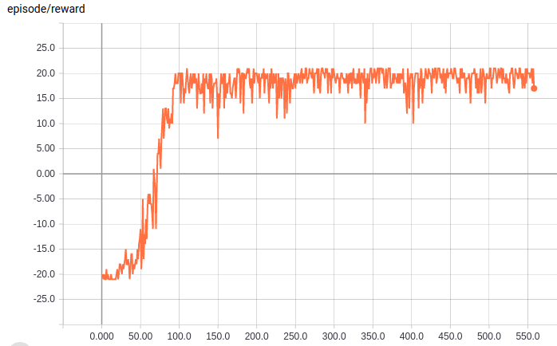
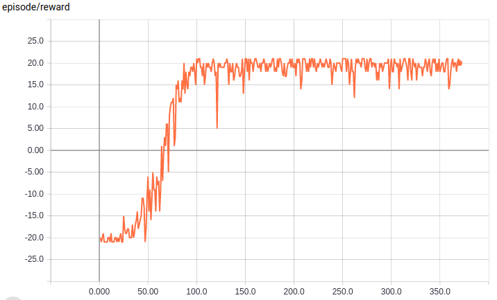

## Natual & Double Deep Q-learning

This DQN example contains following implementations:  

*atari_play.py:* This module is designed to solve atari tasks. This module implements double deep q-learning and can be switched to original deep q-learning via run_project/atari_config.yaml. By default, it uses the original q-network which takes the stacked 2-D grapic observations as the input and q-values as the output.  

*gym_workout.py:* This module is designed to solve openai gym classic control problems, which is a different learning environment than ale atari environment. This module implements original deep q-learning and can be switched to double deep q-learning via run_project/gym_config.yaml.  By default, it uses the original q-network which takes the stacked 1-D nparray observations as the input and q-values as the output.  

Check the config to see what you can change and how to switch between different versions of deep q-learning.  

#### 1. Human-Level Control Through Deep Reinforcement Learning
Source: https://www.nature.com/articles/nature14236  

This is the original deep q-learning (Nature version). It is also the basic one. 

In this repo the only difference is that I "maxpooled" through all skipped frames rather than just using the last two frames (as in original publication and openai baselines repo) since I found the former works better. 

This DQN is also known as "natural DQN".  

#### 2. Deep Reinforcement Learning with Double Q-learning
Source: https://arxiv.org/abs/1509.06461  

This is the improved version of deep q-learning trying to tackle the problem of agent overestimating action values in the preivous natural DQN.

&nbsp;  

**Run Example:**

```bash
$ cd run_project/
$ sh [-h] <script filename> <options>
# for example, you can try sh ATARI.sh -N testrun --local
# you can always use sh <script filename> [-h] for options help
```

&nbsp;  

**Test Atari Learning Result:**

```bash
$ cd run_project/
$ sh TEST.sh -N <run name>
# for example, you can try sh TEST.sh -N test_agent
```

&nbsp;  

**Result Demo:**  
1. Natural DQN  
  
*(reward/episode while training ale atari PongNoFrameskip-v4 via Natrual DQN)*  

2. Double DQN  
  
*(reward/episode while training ale atari PongNoFrameskip-v4 via Double DQN)*  


