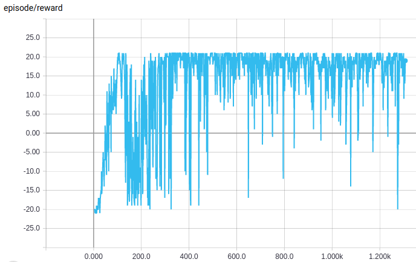
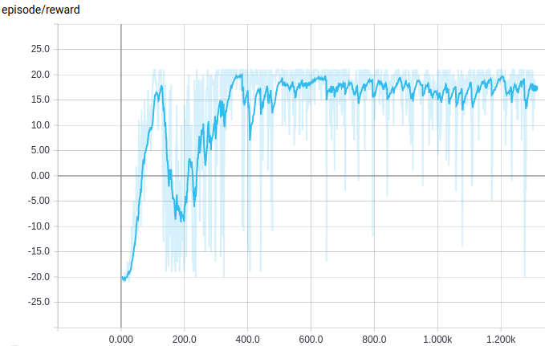

## Gorila DQN

This example project implements Gorila DQN, a distributed training strategy via parameter server architecture.  

Since it is a distributed program, it is environment sensible so it does not guarantee a perfect work on  
your environment. I use slurm to develope it and have setup a local run mode to generate some dummy slurm  
environment variables to let it run without slurm. While this should work, it has the probability for failure.  

Also, this distributed module has only been tested under 'gloo' backend. It may fall under other circumstances.

This example's bash launch script and config are vary different from previous ones. You'd better check the  
script helper before using it. Also check the config to see what you can change.

#### 1. Massively Parallel Methods for Deep Reinforcement Learning
Source: https://arxiv.org/abs/1507.04296  


#### (To do) Asynchronous Stochastic Gradient Descent with Delay Compensation
Source: https://arxiv.org/abs/1609.08326

&nbsp;  

**Run Example:**  

- to be familiar with the launch script  

> ```bash
> $ cd run_project/
> $ sh [-h] <script filename> <options>
> # you can always use sh <script filename> [-h] for options help
> # USAGE: ATARI.sh <OPTIONS...>
> #           [-h][-G, --gpu[=]<corresp. to srun gres gpu:>]
> #           [-h][-L, --local    using lrun instead of srun]
> #           [-h][-c, --cpus-per-task[=]<num cpus per task>]
> #           [-h][-n, --ntasks[=]<total num tasks>]
> #           [-h][    --ntasks-per-node[=]<num tasks per node>]
> #           [-h][    --prefix[=]<run name prefix>]
> #           [-h][-N, --name[=]<run name suffix>]
> #           [-h][-p, --partition=<srun partition>]
> ```

- if you are using slurm workload manager, you can try:  

> ```bash
> # you can try this for a 8gpu, single node job setting
> $ sh ATARI.sh -N rungpu8 -n 8 --gpu=8 -p <partition name>
> # or if you wanna run it on multiple nodes (e.g. 16gpus on 2 nodes), try:
> $ sh ATARI.sh -N rungpu16 -p <partition name> -n 16 --gpu=8 --ntasks-per-node=8
> ```

- if you want to launch Gorila DQN without slurm, you may try:  

> ```bash
> # may not work but you can try things lile
> $ sh ATARI.sh -N localrun -n 8 --local
> ```

&nbsp;  

**Test Learning Result:**

```bash
$ cd run_project/
$ sh TEST.sh -N <run name>
# for example, you can try sh TEST.sh -N test_agent
```

&nbsp;  

**Result Demo:**  
1. Gorila DQN (without smoothing)  
  
*(reward/episode while training ale atari PongNoFrameskip-v4 via Gorila DQN with 1 server, 3 clients)*  

2. Double DQN (with smoothing)  
  
*(reward/episode while training ale atari PongNoFrameskip-v4 via Double DQN with 1 server, 3 clients)*  


