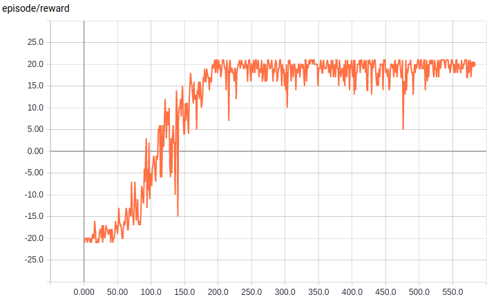
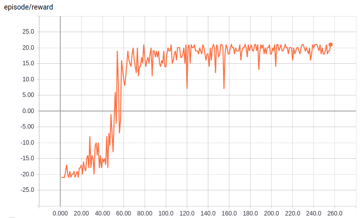

## Prioritized & Dueling DQN

This example project implements DQN wit proiritized replay and dueling DQN.
Check the config to see what you can change and how to switch between different versions of deep q-learning.  

#### 1. Prioritized Experience Replay
Source: https://arxiv.org/abs/1511.05952


#### 2. Dueling Network Architectures for Deep Reinforcement Learning
Source: https://arxiv.org/abs/1511.06581  

&nbsp;  

**Run Example:**

```bash
$ cd run_project/
$ sh [-h] <script filename> <options>
# for example, you can try sh ATARI.sh -N testrun --local
# you can always use sh <script filename> [-h] for options help
```

&nbsp;  

**Test Learning Result:**

```bash
$ cd run_project/
$ sh TEST.sh -N <run name>
# for example, you can try sh TEST.sh -N test_agent
```

&nbsp;  

**Result Demo:**  
1. Prioritized DQN  
  
*(reward/episode while training ale atari PongNoFrameskip-v4 via Prioritized DQN)*  

2. Dueling DQN  
  
*(reward/episode while training ale atari PongNoFrameskip-v4 via Dueling DQN)*   


